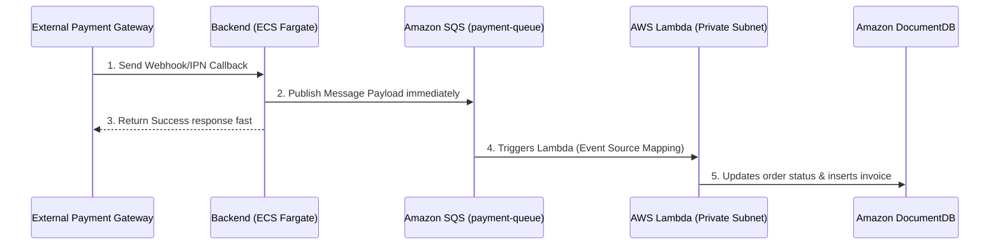

# Step 5: Configure Serverless Payment & Message Queues

The integration and serverless layer manages incoming Webhook/IPN payments callback events from Momo, VNPay, and Stripe. We implement a decoupled architecture using **Amazon SQS** as a durable message buffer, combined with **AWS Lambda** executing inside the Private Subnets to process transactions, ensuring no transaction is lost even during high traffic surges.

---

### Payment Webhook Architecture Flow


---

### Step-by-Step Practical Lab

#### 1. Provision Amazon SQS Message Queue
1. Navigate to the **Amazon SQS** console page and click **Create Queue**.
2. Select **Standard Queue** type (providing maximum message throughput).
3. Input Name: `payment-queue`.
4. Keep default configuration settings (Message retention period: 4 days) and click **Create Queue**.
5. Copy the **Queue URL** (e.g., `https://sqs.ap-southeast-1.amazonaws.com/123456789012/payment-queue`).


#### 2. Configure Backend Webhook Push to SQS
* Within the Backend NodeJS application, implement the API endpoint representing the payment callback.
* To avoid long-running database write bottlenecks during payment responses, the backend verifies the checksum, writes the message to SQS, and replies `200 OK` to the bank gateway instantly:
```javascript
const { SQSClient, SendMessageCommand } = require("@aws-sdk/client-sqs");
const sqs = new SQSClient({ region: "ap-southeast-1" });

app.post("/api/payment/webhook", async (req, res) => {
    // 1. Verify payment signature (Mock logic)
    const payload = req.body;
    const isValid = verifySignature(payload);
    if (!isValid) return res.status(400).send("Invalid Signature");

    // 2. Publish payload to SQS Queue
    const params = {
        QueueUrl: process.env.SQS_QUEUE_URL,
        MessageBody: JSON.stringify({
            orderId: payload.orderId,
            transactionId: payload.vnp_TransactionNo || payload.momo_TransId,
            amount: payload.amount,
            status: "PAID"
        })
    };

    try {
        await sqs.send(new SendMessageCommand(params));
        // Respond to the gateway immediately to prevent timeout errors
        res.status(200).json({ RspCode: "00", Message: "Confirm Success" });
    } catch (err) {
        console.error("SQS queue push failed:", err);
        res.status(500).send("Internal Error");
    }
});
```

#### 3. Create AWS Lambda Event Consumer
AWS Lambda acts as a serverless FaaS function executing inside **Private Subnet 5** of the VPC. It automatically starts processing ONLY when messages land in the queue, saving costs.
1. Open the **AWS Lambda** console and click **Create function**.
2. Apply configurations:
   * **Name:** `j2car-payment-processor`
   * **Runtime:** `Node.js 18.x`
   * **VPC:** Target `J2Car-Production-VPC` and select Private Subnet 5 and Private Subnet 6.
   * **Execution Role:** Assign a role with `AWSLambdaVPCAccessExecutionRole` and permissions to consume SQS messages (`sqs:ReceiveMessage`, `sqs:DeleteMessage`, `sqs:GetQueueAttributes`).
3. Write the database update and invoice generation logic:
```javascript
const { MongoClient } = require("mongodb");

const mongoUri = process.env.MONGO_URI; 
let cachedDb = null;

async function connectToDatabase() {
    if (cachedDb) return cachedDb;
    
    // Connect to DocumentDB using SSL CA certificates
    const client = await MongoClient.connect(mongoUri, {
        tls: true,
        tlsCAFile: "/var/task/global-bundle.pem", // Package CA cert with code
        useNewUrlParser: true,
        useUnifiedTopology: true
    });
    
    cachedDb = client.db("j2car");
    return cachedDb;
}

exports.handler = async (event) => {
    console.log("Received SQS batch records:", JSON.stringify(event));
    const db = await connectToDatabase();
    
    for (const record of event.Records) {
        const body = JSON.parse(record.body);
        const { orderId, transactionId, amount, status } = body;
        
        console.log(`Processing transaction update for Order: ${orderId}`);
        
        // 1. Update Order Status in DocumentDB
        await db.collection("orders").updateOne(
            { _id: orderId },
            { $set: { status: "PAID", updatedAt: new Date() } }
        );
        
        // 2. Insert Invoice Record in DocumentDB
        await db.collection("invoices").insertOne({
            orderId,
            transactionId,
            amount,
            status: "SUCCESS",
            createdAt: new Date()
        });
    }
    return { status: "processed" };
};
```
4. Package the Lambda deployment folder containing your code and the SSL `global-bundle.pem` certificate, then upload and deploy.
5. Create an **SQS Trigger** mapping the SQS `payment-queue` to the Lambda function.


---

### Verification
* Post a mock IPN request to the Backend API endpoint.
* Check CloudWatch Logs for the Lambda function to confirm SQS trigger invocation, SSL database connection, and invoice record writes.
* Verify the order status is updated to `PAID` in your DocumentDB collection and a corresponding invoice is created.
