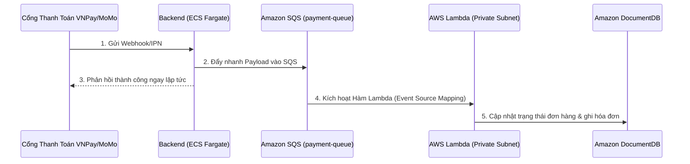

# Bước 5: Cài đặt Hệ thống Xử lý Thanh toán Bất đồng bộ (Serverless Pipeline)

Lớp tích hợp bất đồng bộ quản lý luồng Webhook/IPN phản hồi từ các cổng thanh toán Momo, VNPay gửi về. Chúng ta triển khai mô hình kiến trúc tách rời (Decoupled architecture) sử dụng **Amazon SQS** làm hàng đợi tin nhắn đệm kết hợp với **AWS Lambda** chạy trong Private Subnet để xử lý nghiệp vụ, nhằm đảm bảo không bao giờ bị mất mát giao dịch kể cả khi Backend bị quá tải.

---

### Sơ đồ Luồng Xử lý Thanh toán


---

### Hướng dẫn Thực hành Từng bước

#### 1. Khởi tạo Hàng đợi Tin nhắn Amazon SQS
1. Truy cập console **Amazon SQS** và click **Create Queue**.
2. Chọn loại **Standard Queue** (Hàng đợi tiêu chuẩn, cung cấp thông lượng cực cao).
3. Đặt tên hàng đợi: `payment-queue`.
4. Giữ các cấu hình mặc định (Message retention period: 4 ngày) và nhấn **Create Queue**.
5. Sao chép lại **Queue URL** (ví dụ: `https://sqs.ap-southeast-1.amazonaws.com/123456789012/payment-queue`).


#### 2. Cấu hình Backend Đẩy Sự Kiện Webhook Vào SQS
* Trong mã nguồn Backend NodeJS Express, chúng ta viết API tiếp nhận Webhook từ ngân hàng.
* Thay vì chạy logic cập nhật cơ sở dữ liệu nặng nề ngay lập tức, Backend chỉ kiểm tra chữ ký Checksum, đẩy nhanh nội dung giao dịch vào SQS và phản hồi nhanh mã `200 OK` cho ngân hàng:
```javascript
const { SQSClient, SendMessageCommand } = require("@aws-sdk/client-sqs");
const sqs = new SQSClient({ region: "ap-southeast-1" });

app.post("/api/payment/webhook", async (req, res) => {
    // 1. Kiểm tra chữ ký Checksum bảo mật (Giả lập logic)
    const payload = req.body;
    const isValid = verifySignature(payload);
    if (!isValid) return res.status(400).send("Invalid Signature");

    // 2. Đẩy thông tin giao dịch vào SQS
    const params = {
        QueueUrl: process.env.SQS_QUEUE_URL,
        MessageBody: JSON.stringify({
            orderId: payload.orderId,
            transactionId: payload.vnp_TransactionNo || payload.momo_TransId,
            amount: payload.amount,
            status: "PAID"
        })
    };

    try {
        await sqs.send(new SendMessageCommand(params));
        // Trả kết quả ngay lập tức cho ngân hàng để tránh quá hạn (Timeout)
        res.status(200).json({ RspCode: "00", Message: "Confirm Success" });
    } catch (err) {
        console.error("Lỗi đẩy SQS:", err);
        res.status(500).send("Internal Error");
    }
});
```

#### 3. Tạo Hàm AWS Lambda Xử Lý Sự Kiện & Ghi Hóa Đơn
Hàm Lambda hoạt động theo mô hình Serverless FaaS, chạy ngầm trong **Private Subnet 5** của VPC. Lambda sẽ tự động được kích hoạt (Trigger) chỉ khi có tin nhắn trong hàng đợi SQS, giúp tiết kiệm chi phí tối đa.
1. Truy cập console **AWS Lambda** -> **Create function**.
2. Thiết lập:
   * **Name:** `j2car-payment-processor`
   * **Runtime:** `Node.js 18.x`
   * **VPC:** Chọn `J2Car-Production-VPC` và chỉ định Private Subnet 5 + Private Subnet 6.
   * **Execution Role:** Gán IAM Role có quyền `AWSLambdaVPCAccessExecutionRole` và quyền đọc tin nhắn từ SQS (`sqs:ReceiveMessage`, `sqs:DeleteMessage`, `sqs:GetQueueAttributes`).
3. Viết mã xử lý kết nối DocumentDB và ghi hóa đơn:
```javascript
const { MongoClient } = require("mongodb");

const mongoUri = process.env.MONGO_URI; 
let cachedDb = null;

async function connectToDatabase() {
    if (cachedDb) return cachedDb;
    
    // Kết nối đến DocumentDB sử dụng mã hóa SSL qua cert global-bundle.pem
    const client = await MongoClient.connect(mongoUri, {
        tls: true,
        tlsCAFile: "/var/task/global-bundle.pem", // Nạp cert kèm theo gói code Lambda
        useNewUrlParser: true,
        useUnifiedTopology: true
    });
    
    cachedDb = client.db("j2car");
    return cachedDb;
}

exports.handler = async (event) => {
    console.log("Nhận gói tin từ SQS:", JSON.stringify(event));
    const db = await connectToDatabase();
    
    for (const record of event.Records) {
        const body = JSON.parse(record.body);
        const { orderId, transactionId, amount, status } = body;
        
        console.log(`Đang xử lý thanh toán đơn hàng: ${orderId}`);
        
        // 1. Cập nhật trạng thái đơn hàng thành PAID
        await db.collection("orders").updateOne(
            { _id: orderId },
            { $set: { status: "PAID", updatedAt: new Date() } }
        );
        
        // 2. Ghi nhận hóa đơn thanh toán vào DB
        await db.collection("invoices").insertOne({
            orderId,
            transactionId,
            amount,
            status: "SUCCESS",
            createdAt: new Date()
        });
    }
    return { status: "processed" };
};
```
4. Đóng gói mã nguồn cùng tệp chứng chỉ SSL `global-bundle.pem`, tải lên Lambda và Deploy.
5. Tạo **Trigger** liên kết SQS `payment-queue` với hàm Lambda vừa tạo.


---

### Kiểm tra kết quả
* Gửi một request Webhook giả lập tới API của Backend.
* Kiểm tra CloudWatch Logs của Lambda để xem nhật ký nhận tin nhắn từ SQS, kết nối thành công DocumentDB qua SSL và ghi nhận hóa đơn.
* Kiểm tra trạng thái đơn hàng trong DocumentDB đã chuyển sang `PAID` và có bản ghi mới trong bảng `invoices`.
